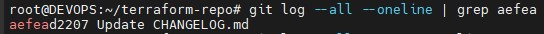
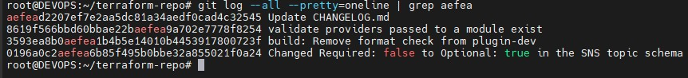
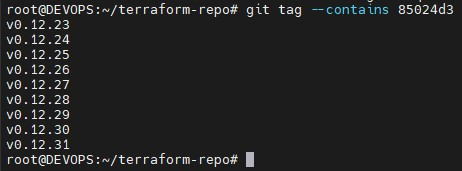
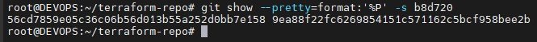
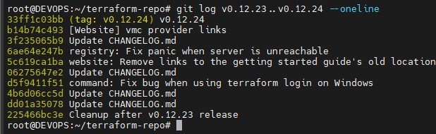
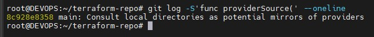
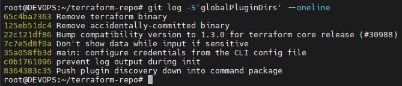
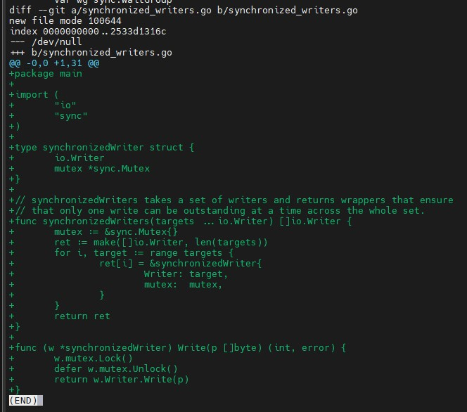

# Домашнее задание к занятию «Инструменты Git» - Иванов Сергей

## Цель задания

### В результате выполнения задания вы:
* научитесь работать с утилитами Git;
* потренируетесь решать типовые задачи, возникающие при работе в команде.

### Инструкция к заданию
1. Склонируйте репозиторий с исходным кодом Terraform.
2. Создайте файл для ответов на задания в своём репозитории, после выполнения прикрепите ссылку на .md-файл с ответами в личном кабинете.
3. Любые вопросы по решению задач задавайте в чате учебной группы.

## Задание

В клонированном репозитории:
1. Найдите полный хеш и комментарий коммита, хеш которого начинается на aefea.

**Ответ**

Команда:
```bash
git log --all --oneline | grep aefea
```
или
```bash
git log --all --pretty=oneline | grep aefea
```





* Результат даст полный хеш и комментарий коммита.
* Полный хеш можно использовать для последующих команд (**git show <hash>**).

2. Ответьте на вопросы.
* Какому тегу соответствует коммит **85024d3**?

**Ответ**

Команда:

```bash
git tag --contains 85024d3
```

Покажет все теги, в которые входит этот коммит.

Обычно вывод: например **v0.12.22.**



* Сколько родителей у коммита b8d720? Напишите их хеши.

**Ответ**

Команда:

```bash
git show --pretty=format:'%P' -s b8d720
```
**%P** выводит список родителей коммита.



Если коммит **merge** — будет два или более родителя, иначе один.

Можно потом посмотреть полный хеш родителя:

```bash
git log --oneline b8d720^1
git log --oneline b8d720^2
```

* Перечислите хеши и комментарии всех коммитов, которые были сделаны между тегами v0.12.23 и v0.12.24.

**Ответ**


Команда:

```bash
git log v0.12.23..v0.12.24 --oneline
```


**Вывод**: все коммиты, сделанные после **v0.12.23** и до **v0.12.24**.

Каждый коммит отображается как **<hash> <commit message>**.


* Найдите коммит, в котором была создана функция **func providerSource**, её определение в коде выглядит так: **func providerSource(...)** (вместо троеточия перечислены аргументы).

**Ответ**

Используем **git log с -S** (поиск по добавлению строки в код):

```bash
git log -S'func providerSource(' --oneline
```

Найдёт коммит, где была впервые добавлена функция.



* Найдите все коммиты, в которых была изменена функция globalPluginDirs.

**Ответ**

Команда:

```bash
git log -L :globalPluginDirs:. --oneline
```
**-L :funcname:file** позволяет отследить историю изменений конкретной функции.

Если не знаем файл точно, можно делать через поиск по имени функции:

```bash
git log -S'globalPluginDirs' --oneline
```




* Кто автор функции synchronizedWriters?

**Ответ**

Команда:

```bash
git log -S'synchronizedWriters' --pretty=format:'%an <%ae>' -p
```
**%an** — имя автора, **%ae** — email автора.

Покажет коммит, в котором функция была добавлена, и кто её автор.




В качестве решения ответьте на вопросы и опишите, как были получены эти ответы.

## Правила приёма домашнего задания
В личном кабинете отправлена ссылка на .md-файл в вашем репозитории.

## Критерии оценки

Зачёт:
* выполнены все задания;
* ответы даны в развёрнутой форме;
* приложены соответствующие скриншоты и файлы проекта;
* в выполненных заданиях нет противоречий и нарушения логики.

На доработку:
* задание выполнено частично или не выполнено вообще;
* в логике выполнения заданий есть противоречия и существенные недостатки.